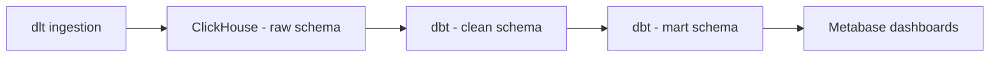

# 🎵 Chinook Data Pipeline

This repository contains an end-to-end data pipeline using the **Chinook music store database**.  
The Chinook database is a sample OLTP schema for a digital music store that includes tables for **artist, album, customer, employee, genre, invoice, invoice line, media type, playlist, playlist track, and track**.  

We follow a **RAW → CLEAN → MART** layered architecture, transforming transactional data into a **dimensional star schema** for simplified reporting and building **interactive dashboards** for insights.

---

## 1. Project Overview

**Dataset Used:**  
Chinook Music Store database (OLTP sample for a digital music store).

**Goal of the Exercise:**  
Transform normalized transactional data into a **dimensional star schema** for business intelligence and analytics.

**Team Setup:**  
Group collaboration with task splitting across ingestion, modeling, BI dashboarding, and documentation.  
We adjusted workloads based on availability and supported each other when issues arose.

**Environment Setup:**  
- Shared ClickHouse instance running in Docker for group development  
- Local dbt setups for individual testing and building  

---

## 2. Architecture & Workflow

**Pipeline Flow:**


**Tools Used:**

* **Ingestion:** dlt (Python)
* **Database:** ClickHouse (Docker setup)
* **Modeling:** dbt (SQL-based transformations)
* **Visualization:** Metabase
* **Testing & Queries:** DBeaver (sandbox verification)

**Medallion Architecture Application:**

* **Bronze (Raw):** Ingestion of source data into raw schema
* **Silver (Clean):** Standardization, type casting, null handling
* **Gold (Mart):** Star schema with fact & dimension tables for BI

---

## 3. Modeling Process

### Source Structure (Normalized)

Chinook database is in **3NF**, containing normalized tables for sales, customers, employees, music metadata, and invoices.

### RAW Layer – Ingestion with dlt (Python)

```python
import os
import dlt
import psycopg2
from psycopg2.extras import RealDictCursor

def get_connection():
    host     = os.environ["POSTGRES_HOST"]
    port     = int(os.environ["POSTGRES_PORT"])
    user     = os.environ["POSTGRES_USER"]
    password = os.environ["POSTGRES_PASSWORD"]
    dbname   = os.environ["POSTGRES_DB"]

    return psycopg2.connect(
        host=host,
        port=port,
        user=user,
        password=password,
        dbname=dbname
    )

@dlt.resource(write_disposition="append", name="artists_mina")
def artists():
    # Extract all artists from the Chinook sample DB.
    conn = get_connection()
    cur = conn.cursor(cursor_factory=RealDictCursor)
    cur.execute("SELECT * FROM artist;")
    for row in cur.fetchall():
        yield dict(row)
    conn.close()

print("Fetching and loading...")
load_info = pipeline.run(artists())
print("records loaded:", load_info)

if __name__ == "__main__":
    run()
```

Run command:

```bash
docker compose --profile jobs run dlt python pipelines/dlt-chinook-pipeline.py
```

---

### CLEAN Layer – dbt Transformations

**Example dbt model:**

```sql
{{ config(materialized="view", schema="clean", tags=["staging","chinook"]) }}
-- Standardize column names/types per table; no business logic.
select
  cast(artist_id as Nullable(Int64))  as artist_id,
  cast(name      as Nullable(String)) as artist_name
from {{ source('raw', 'chinook___artists_mina') }}
```

**Source definition:**

```yaml
version: 2
sources:
 - name: raw
   database: raw
   tables:
     - name: chinook___artists_mina
```

---

### MART Layer – Star Schema Design

**Fact Table:**
`FactInvoiceLine` (transaction-level sales data: quantity, unit price, line amount; keys: track, genre, customer, date, employee, album, artist).

**Dimension Tables:**

* `DimCustomer`
* `DimDate`
* `DimTrack`
* `DimEmployee`
* `DimGenre`
* `DimArtist`
* `DimAlbum`

**Fact-Dimension SQL Example:**

```sql
DROP TABLE IF EXISTS sandbox.FactInvoiceLine2_Divine;

CREATE TABLE sandbox.FactInvoiceLine2_Divine
engine = MergeTree
ORDER BY tuple()
AS
SELECT
   il.invoice_line_id           AS InvoiceLineKey,
   il.quantity                  AS Quantity,
   il.unit_price                AS UnitPrice,
   il.unit_price * il.quantity  AS LineAmount,
   il.track_id                  AS TrackKey,
   g.genre_id                   AS GenreKey,
   c.customer_id                AS CustomerKey,
   DATE(i.invoice_date)         AS DateKey,
   e.employee_id                AS EmployeeKey,
   al.album_id                  AS AlbumKey,
   ar.artist_id                 AS ArtistKey
FROM clean.stg_chinook__invoice_line_divine il
JOIN clean.stg_chinook__invoice_divine      i     ON il.invoice_id = i.invoice_id
JOIN clean.stg_chinook__customer_divine     c     ON i.customer_id = c.customer_id
JOIN clean.stg_chinook__employee_divine     e     ON c.support_rep_id = e.employee_id
JOIN clean.stg_chinook__track_divine        t     ON il.track_id = t.track_id
JOIN clean.stg_chinook__genre_divine        g     ON t.genre_id = g.genre_id
JOIN clean.stg_chinook__album_divine        al    ON t.album_id = al.album_id
JOIN clean.stg_chinook__artist_divine       ar    ON al.artist_id = ar.artist_id;
```

**Date Dimension Example:**

```sql
DROP TABLE IF EXISTS sandbox.DimDate_Divine;

CREATE TABLE sandbox.DimDate_Divine
engine = MergeTree
ORDER BY tuple()
AS
SELECT
   DATE(invoice_date) AS date_id,
   YEAR(invoice_date) AS year,
   MONTH(invoice_date) AS month,
   QUARTER(invoice_date) AS quarter
FROM clean.stg_chinook__invoice_divine;
```

---

## 4. Collaboration & Setup

**Task Splitting:**

* Ingestion: Python + dlt scripts
* Modeling: dbt SQL transformations
* Visualization: Metabase dashboards
* Documentation: README & presentation outline

**Shared vs Local Work:**

* Shared ClickHouse instance sometimes caused sync/version conflicts
* Local dbt environments allowed independent testing before merging

**Best Practices Learned:**

* Git for version control of dbt projects
* Clear naming conventions for tables and models
* Documenting assumptions and changes for smoother collaboration

---

## 5. Business Questions & Insights

**Business Questions Explored:**

* Which **genres generate the most revenue per country**?
* How can we segment **customers based on spending tiers**?
* What are the **monthly sales trends**?
* Which **employees drive the most sales**?
* What are the **most popular tracks by sales volume**?
* How does **regional pricing vary** across markets?

**Dashboards / Queries:**
Metabase dashboards included:

* Top Revenue by Genre per Country
* Customer Segmentation (Spending Tier)
* Monthly Sales Trend
* Employee Sales Performance
* Popular Tracks by Quantity Sold
* Regional Pricing Insights (with map visualization)

**Key Insights:**

* **Rock** dominated as the top-selling genre in North America.
* **Customer segmentation** revealed high-value tiers that could be targeted with loyalty campaigns.

---

## 6. Key Learnings

**Technical Learnings:**

* Implementing ingestion pipelines with **dlt**
* Data transformations & schema design with **dbt**
* Creating star schemas for BI queries
* SQL joins, aggregations, and window functions in ClickHouse

**Team Learnings:**

* Coordinating in a hybrid shared-local setup
* Importance of **documentation** for onboarding and debugging
* Value of **dashboards** in storytelling with data

**Real-World Connection:**
This exercise mirrors how **data engineering teams** in industry build **ETL pipelines, data warehouses, and BI dashboards** for business decision-making.

---

## 7. Future Improvements

**Next Steps with More Time:**

* Add orchestration using **Airflow or Prefect**
* Implement **data quality tests** (dbt tests, Great Expectations)
* Optimize queries for larger datasets
* Automate dashboard refreshes

**Generalization:**
This pipeline approach could be applied to other business domains, such as:

* E-commerce (customer purchase history → sales insights)
* Education (student activity logs → dropout prediction)
* Entertainment (streaming analytics → top performers & content trends)

---
