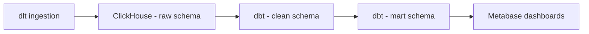

# 🎵 Chinook Data Pipeline

This repository contains an end-to-end data pipeline using the **Chinook music store database**. It’s a sample OLTP database for a digital music store that includes:

* **artist, album, customer, employee, genre, invoice, invoice line, media type, playlist, playlist track, and track** tables.

We follow a **RAW → CLEAN → MART** layered architecture, transforming transactional data into a **star schema** for simplified reporting and building interactive dashboards for insights.

---

## ⚙️ Architecture & Data Flow



---

## 🚀 Your Modeling Journey

### 🔹 RAW Layer

* Ingestion using **Python & DLT**
* Loads raw Chinook tables into ClickHouse

**Sample Code:**

```python
import os
import dlt
import psycopg2
from psycopg2.extras import RealDictCursor

def get_connection():
    host     = os.environ["POSTGRES_HOST"]
    port     = int(os.environ["POSTGRES_PORT"])
    user     = os.environ["POSTGRES_USER"]
    password = os.environ["POSTGRES_PASSWORD"]
    dbname   = os.environ["POSTGRES_DB"]

    return psycopg2.connect(
        host=host,
        port=port,
        user=user,
        password=password,
        dbname=dbname
    )

@dlt.resource(write_disposition="append", name="artists_mina")
def artists():
    """Extract all artists from the Chinook sample DB."""
    conn = get_connection()
    cur = conn.cursor(cursor_factory=RealDictCursor)
    cur.execute("SELECT * FROM artist;")
    for row in cur.fetchall():
        yield dict(row)
    conn.close()

print("Fetching and loading...")
load_info = pipeline.run(customer())
print("records loaded:", load_info)

if __name__ == "__main__":
    run()
```

**Command:**

```bash
docker compose --profile jobs run dlt python pipelines/dlt-chinook-pipeline.py
```

---

### 🔹 CLEAN Layer

* Transformations with **dbt & SQL scripts**
* Standardization of column names and data types
* Dropping unnecessary columns
* Handling null values

**Example dbt model:**

```sql
{{ config(materialized="view", schema="clean", tags=["staging","chinook"]) }}
-- Standardize column names/types per table; no business logic.
select
  cast(artist_id as Nullable(Int64))  as artist_id,
  cast(name      as Nullable(String)) as artist_name
from {{ source('raw', 'chinook___artists_mina') }}
```

**Source definition:**

```yaml
version: 2

sources:
 - name: raw
   database: raw  # Explicitly specify ClickHouse database
   tables:
     - name: chinook___artists_mina
```

---

### 🔹 MART Layer

* **Star schema design**
* **Fact & Dimension tables** for analytics
* **Normalization** for simplified queries

**Schema Example:**

* Fact Table: `FactInvoiceLine`
* Dimensions: `DimTrack`, `DimCustomer`, `DimEmployee`, `DimGenre`, `DimDate`, `DimAlbum`, `DimArtist`

**Fact-Dimension Model:**

```sql
DROP TABLE IF EXISTS sandbox.FactInvoiceLine2_Divine;

CREATE TABLE sandbox.FactInvoiceLine2_Divine
engine = MergeTree
ORDER BY tuple()
AS
SELECT
   il.invoice_line_id           AS InvoiceLineKey,
   il.quantity                  AS Quantity,
   il.unit_price                AS UnitPrice,
   il.unit_price * il.quantity  AS LineAmount,
   il.track_id                  AS TrackKey,
   g.genre_id                   AS GenreKey,
   c.customer_id                AS CustomerKey,
   DATE(i.invoice_date)         AS DateKey,
   e.employee_id                AS EmployeeKey,
   al.album_id                  AS AlbumKey,
   ar.artist_id                 AS ArtistKey
FROM clean.stg_chinook__invoice_line_divine il
JOIN clean.stg_chinook__invoice_divine      i     ON il.invoice_id = i.invoice_id
JOIN clean.stg_chinook__customer_divine     c     ON i.customer_id = c.customer_id
JOIN clean.stg_chinook__employee_divine     e     ON c.support_rep_id = e.employee_id
JOIN clean.stg_chinook__track_divine        t     ON il.track_id = t.track_id
JOIN clean.stg_chinook__genre_divine        g     ON t.genre_id = g.genre_id
JOIN clean.stg_chinook__album_divine        al    ON t.album_id = al.album_id
JOIN clean.stg_chinook__artist_divine       ar    ON al.artist_id = ar.artist_id
```

**Date Dimension:**

```sql
DROP TABLE IF EXISTS sandbox.DimDate_Divine;

CREATE TABLE sandbox.DimDate_Divine
engine = MergeTree
ORDER BY tuple()
AS
SELECT
   DATE(invoice_date) AS date_id,
   YEAR(invoice_date) AS year,
   MONTH(invoice_date) AS month,
   QUARTER(invoice_date) AS quarter
FROM clean.stg_chinook__invoice_divine;
```

---

## 🧪 Testing & Sandbox Queries

* Verified transformations in a **sandbox environment (DBeaver)**
* Confirmed joins and aggregations work as expected

---

## 📊 Visualization (Metabase)

Connected **mart schema** to Metabase and built dashboards for:

* Top Revenue by Genre per Country
* Customer Segmentation (Spending Tier)
* Monthly Sales Trend
* Employee Sales Performance
* Popular Tracks by Quantity Sold
* Regional Pricing Insights
* Regional Pricing Insights Map

---

