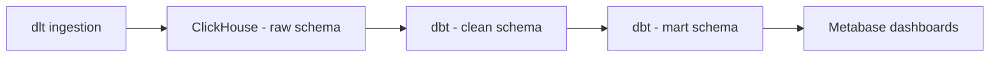

# Open University Learning Analytics Dataset (OULAD) Documentation
This repository contains an end-to-end data pipeline using the **Open University Learning Analytics Dataset**.
The dataset includes tables for students, registrations, assessments, and virtual learning environment (VLE) logs, covering over 32,000 students and ~10M interactions.

We follow a **RAW → CLEAN → MART** layered architecture, transforming transactional data into a **dimensional star schema** for simplified reporting and building **interactive dashboards** for insights.

---
## 1. Project Overview

**Dataset Used:**
Open University Learning Analytics Dataset – Education analytics (Open University UK).

**Goal of the Exercise:**
The main objective is to design an end-to-end data pipeline that transforms raw OULAD CSV files into a dimensional star schema for analytics. The final layer powers interactive dashboards to answer key questions like:
- Do demographics influence dropout?
- How does engagement in the VLE impact performance?

**Team Setup:**
Group collaboration with task splitting across ingestion, modeling, BI dashboarding, and documentation.
We adjusted workloads based on availability and supported each other when issues arose.

**Environment Setup:**
- Shared ClickHouse instance running in Docker for group development
- Local dbt setups for individual testing and building
---
## 2. Architecture & Workflow
**Pipeline Flow:**

**Tools Used:**
* **Ingestion:** dlt (Python)
* **Database:** ClickHouse (Docker setup)
* **Modeling:** dbt (SQL-based transformations)
* **Visualization:** Metabase
* **Testing & Queries:** DBeaver (sandbox verification)

**Medallion Architecture Application:**
* **Bronze (Raw):** Ingestion of source data into raw schema
* **Silver (Clean):** Standardization, type casting, null handling
* **Gold (Mart):** Star schema with fact & dimension tables for BI
---
## 3. Modeling Process
### Source Structure (Normalized)
Chinook database is in **3NF**, containing normalized tables for sales, customers, employees, music metadata, and invoices.
### RAW Layer – Ingestion with dlt (Python)
```python
# dlt/pipeline.py
import dlt, pandas as pd
import os

# https://archive.ics.uci.edu/dataset/349/open+university+learning+analytics+dataset
@dlt.resource(write_disposition="append", name="student_assessment")
def student_assessment():
     
    # How to load a local CSV
    # Place file in staging\oulad folder
    ROOT_DIR = os.path.dirname(__file__)
    STAGING_DIR = os.path.join(ROOT_DIR, "staging", "oulad")
    FILE_PATH = os.path.join(STAGING_DIR, "studentAssessment.csv")
    yield pd.read_csv(FILE_PATH).astype(str)
    

def run():
    p = dlt.pipeline(
        pipeline_name="09-dlt-oulad-pipeline",
        destination="clickhouse",
        dataset_name="grp5__oulad",
    )
    print("Fetching and loading...")
    info1 = p.run(student_assessment())     # dlt pulls creds from env-vars
    print("records loaded:", info1)

if __name__ == "__main__":
    run()
```
Run command:
```bash
docker compose --profile jobs run dlt python pipelines/09-dlt-oulad-pipeline.py
```
---
### CLEAN Layer – dbt Transformations
**Example dbt model:**
```sql
{{ config(materialized="view", schema="clean", tags=["staging","oulad"]) }}
-- Standardize column names/types per table; no business logic.
select
  cast(artist_id as Nullable(Int64))  as artist_id,
  cast(name      as Nullable(String)) as artist_name
from {{ source('raw', 'grp5__stg_oulad_student_assessment') }}
```
**Source definition:**
```yaml
version: 2
sources:
 - name: raw
   database: raw
   tables:
     - name: grp5_oulad_student_assessment
```
---
### MART Layer – Star Schema Design
**Fact Table:**
`FactAssessment` (transaction-level sales data: ).

`FactVLEInteractions` (transaction-level sales data: ).

**Dimension Tables:**
* `DimStudent`
* `DimDate`
* `DimPresentation`
* `DimModule`

**Fact-Dimension SQL Example:**
```sql
DROP TABLE IF EXISTS sandbox.FactInvoiceLine2_Divine;
CREATE TABLE sandbox.FactInvoiceLine2_Divine
engine = MergeTree
ORDER BY tuple()
AS
SELECT
   il.invoice_line_id           AS InvoiceLineKey,
   il.quantity                  AS Quantity,
   il.unit_price                AS UnitPrice,
   il.unit_price * il.quantity  AS LineAmount,
   il.track_id                  AS TrackKey,
   g.genre_id                   AS GenreKey,
   c.customer_id                AS CustomerKey,
   DATE(i.invoice_date)         AS DateKey,
   e.employee_id                AS EmployeeKey,
   al.album_id                  AS AlbumKey,
   ar.artist_id                 AS ArtistKey
FROM clean.stg_chinook__invoice_line_divine il
JOIN clean.stg_chinook__invoice_divine      i     ON il.invoice_id = i.invoice_id
JOIN clean.stg_chinook__customer_divine     c     ON i.customer_id = c.customer_id
JOIN clean.stg_chinook__employee_divine     e     ON c.support_rep_id = e.employee_id
JOIN clean.stg_chinook__track_divine        t     ON il.track_id = t.track_id
JOIN clean.stg_chinook__genre_divine        g     ON t.genre_id = g.genre_id
JOIN clean.stg_chinook__album_divine        al    ON t.album_id = al.album_id
JOIN clean.stg_chinook__artist_divine       ar    ON al.artist_id = ar.artist_id;
```
**Date Dimension Example:**
```sql
DROP TABLE IF EXISTS sandbox.DimDate_Divine;
CREATE TABLE sandbox.DimDate_Divine
engine = MergeTree
ORDER BY tuple()
AS
SELECT
   DATE(invoice_date) AS date_id,
   YEAR(invoice_date) AS year,
   MONTH(invoice_date) AS month,
   QUARTER(invoice_date) AS quarter
FROM clean.stg_chinook__invoice_divine;
```
---
## 4. Collaboration & Setup
**Task Splitting:**
* Ingestion: Python + dlt scripts
* Modeling: dbt SQL transformations
* Visualization: Metabase dashboards
* Documentation: README & presentation outline

**Shared vs Local Work:**
* Shared ClickHouse instance sometimes caused sync/version conflicts
* Local dbt environments allowed independent testing before merging

**Best Practices Learned:**
* Clear naming conventions for tables and models
* Documenting assumptions and changes for smoother collaboration
---
## 5. Business Questions & Insights
**Business Questions Explored:**
* Which **genres generate the most revenue per country**?
* How can we segment **customers based on spending tiers**?
* What are the **monthly sales trends**?
* Which **employees drive the most sales**?
* What are the **most popular tracks by sales volume**?
* How does **regional pricing vary** across markets?

**Dashboards / Queries:**
Metabase dashboards included:
* Top Revenue by Genre per Country
* Customer Segmentation (Spending Tier)
* Monthly Sales Trend
* Employee Sales Performance
* Popular Tracks by Quantity Sold
* Regional Pricing Insights (with map visualization)

**Key Insights:**
* **Rock** dominated as the top-selling genre in North America.
* **Customer segmentation** revealed high-value tiers that could be targeted with loyalty campaigns.
---
## 6. Key Learnings
**Technical Learnings:**
* Implementing ingestion pipelines with **dlt**
* Data transformations & schema design with **dbt**
* Creating star schemas for BI queries
* SQL joins, aggregations, and window functions in ClickHouse
**Team Learnings:**
* Coordinating in a hybrid shared-local setup
* Importance of **documentation** for onboarding and debugging
* Value of **dashboards** in storytelling with data
---
## 7. Future Improvements
* Performing data validation as the first process
**Generalization:**
This pipeline approach could be applied to other business domains, such as:
* E-commerce (customer purchase history → sales insights)
* Education (student activity logs → dropout prediction)
* Entertainment (streaming analytics → top performers & content trends)

---
