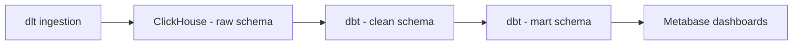
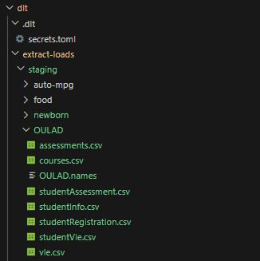
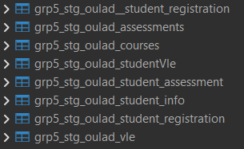
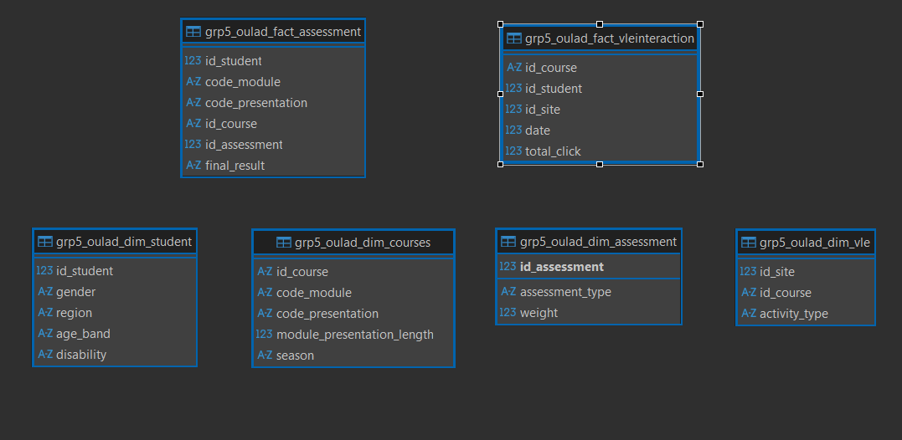

# Open University Learning Analytics Dataset (OULAD) Documentation
This repository contains an end-to-end data pipeline using the **Open University Learning Analytics Dataset**.
The dataset includes tables for students, registrations, assessments, and virtual learning environment (VLE) logs, covering over 32,000 students and ~10M interactions.

We follow a **RAW → CLEAN → MART** layered architecture, transforming transactional data into a **dimensional star schema** for simplified reporting and building **interactive dashboards** for insights.

---
## 1. Project Overview

**Dataset Used:**
Open University Learning Analytics Dataset – Education analytics (Open University UK).

**Goal of the Exercise:**
The main objective is to design an end-to-end data pipeline that transforms raw OULAD CSV files into a dimensional star schema for analytics. The final layer powers interactive dashboards to answer business questions.

**Team Setup:**
Group collaboration with task splitting across ingestion, modeling, BI dashboarding, and documentation.
We adjusted workloads based on availability and supported each other when issues arose.

**Environment Setup:**
- Shared ClickHouse instance running in Docker for group development
- Local dbt setups for individual testing and building


---
## 2. Architecture & Workflow
**Pipeline Flow:**

**Tools Used:**
* Download the csv files of OULAD --> dlt/extra-loads/staging/OULAD



* **Ingestion:** dlt (Python)
* **Database:** ClickHouse (Docker setup)
* **Modeling:** dbt (SQL-based transformations)
* **Visualization:** Metabase
* **Testing & Queries:** DBeaver (sandbox verification)

**Medallion Architecture Application:**
* **Bronze (Raw):** Ingestion of source data into raw schema
* **Silver (Clean):** Standardization, type casting, null handling
* **Gold (Mart):** Star schema with fact & dimension tables for BI
---
## 3. Modeling Process
### Source Structure (Normalized)
Open University Learning Analytics Dataset 
### RAW Layer – Ingestion with dlt (Python)
```python
# dlt/pipeline.py
import dlt, pandas as pd
import os

# https://archive.ics.uci.edu/dataset/349/open+university+learning+analytics+dataset
@dlt.resource(write_disposition="append", name="student_assessment")
def student_assessment():
     
    # How to load a local CSV
    # Place file in staging\oulad folder
    ROOT_DIR = os.path.dirname(__file__)
    STAGING_DIR = os.path.join(ROOT_DIR, "staging", "oulad")
    FILE_PATH = os.path.join(STAGING_DIR, "studentAssessment.csv")
    yield pd.read_csv(FILE_PATH).astype(str)
    

def run():
    p = dlt.pipeline(
        pipeline_name="09-dlt-oulad-pipeline",
        destination="clickhouse",
        dataset_name="grp5__oulad",
    )
    print("Fetching and loading...")
    info1 = p.run(student_assessment())     # dlt pulls creds from env-vars
    print("records loaded:", info1)

if __name__ == "__main__":
    run()
```
Run command:
```bash
docker compose --profile jobs run dlt python pipelines/09-dlt-oulad-pipeline.py
```
---
### CLEAN Layer – dbt Transformations


**Example dbt model:** grp5_stg_oulad_student_assessment.sql
```sql
{{ config(materialized="table", schema="clean", tags=["staging","oulad"]) }} 

-- Standardize names and types for student assessment
select
  cast(id_assessment  as Nullable(Int64)) as assessment_id,
  cast(id_student     as Nullable(Int64)) as student_id,
  cast(date_submitted as Nullable(Int64)) as date_submitted,
  cast(is_banked      as Nullable(Int64)) as is_banked,
  cast(score          as Nullable(Int64)) as score
from {{ source('raw', 'grp5_oulad___student_assessment') }}
```
**Source definition:**
```yaml
version: 2
sources:
 - name: raw
   database: raw
   tables:
     - name: grp5_oulad_student_assessment
```
### Data Quality Check
**Example schema.yml in Clean** 
```yaml
models:
  - name: grp5_stg_oulad_student_info
    columns:
      - name: code_module
        tests: [not_null]
      - name: code_presentation
        tests: [not_null]
      - name: id_student
        tests: [not_null]
      - name: gender
        tests:
          - accepted_values: { values: ["M", "F", "Unknown"] }
      - name: region
        tests: [not_null]
      - name: highest_education
        tests:
          - accepted_values:
              {
                values:
                  [
                    "A Level or Equivalent",
                    "HE Qualification",
                    "Lower Than A Level",
                    "No Formal quals",
                    "Post Graduate Qualification",
                  ],
              }
      - name: imd_band
        tests:
          - accepted_values:
              {
                values:
                  [
                    "0-10%",
                    "10-20%",
                    "20-30%",
                    "30-40%",
                    "40-50%",
                    "50-60%",
                    "60-70%",
                    "70-80%",
                    "80-90%",
                    "90-100%",
                    NULL,
                  ],
              }
      - name: age_band
        tests:
          - accepted_values: { values: ["0-35", "35-55", "55<="] }
      - name: num_of_prev_attempts
        tests: [not_null]
      - name: studied_credits
        tests: [not_null]
      - name: disability
        tests:
          - accepted_values: { values: ["Y", "N"] }
      - name: final_result
        tests:
          - accepted_values:
              { values: ["Pass", "Fail", "Withdrawn", "Distinction"] }
```

---
### MART Layer – Star Schema Design
**Fact Table:**
* `grp5_oulad_fact_assessment`
* `grp5_oulad_vleinteraction` 

**Dimension Tables:**
* `grp5_oulad_dim_student`
* `grp5_oulad_dim_assessment`
* `grp5_oulad_dim_courses`
* `grp5_oulad_dim_vle`



**Fact Table SQL Example:**
```sql
DROP TABLE IF EXISTS mart.grp5_oulad_fact_vleinteraction;

CREATE TABLE mart.grp5_oulad_fact_vleinteraction
engine = MergeTree
ORDER BY tuple()
AS
SELECT
	CONCAT(code_module, code_presentation) AS id_course
	id_student,
	id_site,
	date,
	SUM(sum_click) AS total_click
FROM clean.grp5_stg_oulad_studentVle
GROUP BY id_student, id_site, date, code_module, code_presentation
ORDER BY code_presentation, date;
```
**Dimension Table SQL Example:**
```sql
CREATE TABLE mart.grp5_oulad_dim_courses
ENGINE = MergeTree
ORDER BY tuple()
AS
SELECT
    concat(code_module, code_presentation) AS id_course,
    code_module,
    code_presentation,
    module_presentation_length
FROM clean.grp5_stg_oulad_courses;
```
---
## 4. Collaboration & Setup
**Task Splitting:**
* Ingestion: Python + dlt scripts
* Modeling: dbt SQL transformations
* Visualization: Metabase dashboards
* Documentation: README & presentation outline

**Best Practices Learned:**
* Use group tracker
* Clear naming conventions for tables and models
* Documenting assumptions and changes for smoother collaboration
---
## 5. Business Questions & Insights
**Business Questions Explored:**
* Do **demographics(age, gender, or region) influence dropout rates**?
* Are students with disabilities more likely to drop out or underperform?
* What’s the **overall minimum level of VLE engagement associated with passing a module**?
* Which **modules/presentations have the highest dropout rates**?
* Are some presentations (Spring vs Autumn) more successful in retaining students?


**Dashboards / Queries:** 
*https://ftw.dataengineering.ph/dashboard/45-open-university-learning-analytics*

Metabase dashboards included:

**Demographics**
* Age Band Droupout Percentage
* Gender Droput Percentage
* Region Droupout Rates
* Impact of Disability on Dropout and Performance

**Student Assessment**
* Retention per season
* Module & Presentation Dropout Rates
* Minimum VLE Clicks Needed to Pass (per Module)

---
## 6. Key Learnings
**Technical Learnings:**
* Implementing ingestion pipelines with **dlt**
* Data transformations & schema design with **dbt**
* Creating star schemas for BI queries
* SQL joins, aggregations, and window functions in ClickHouse

**Team Learnings:**
* Set the business question first
* 
* Importance of **documentation** for onboarding and debugging
* 
---
## 7. Future Improvements
* Identify first the stakeholders
* 

**Generalization:**


---


